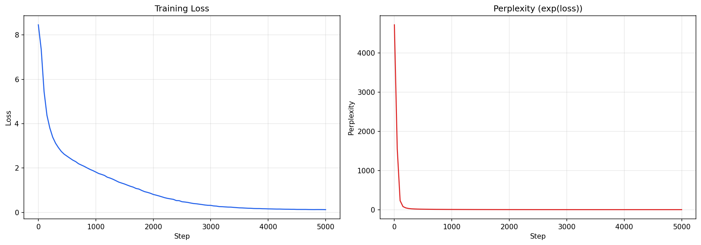

# LMfromzero — A LLaMA-style Language Model Built from Scratch

[](https://python.org)
[](https://pytorch.org)
[](./tests/)
[](./cs336_repo/)
[](./LICENSE)

**从零构建一个完整的 Transformer 语言模型。** 所有核心组件均为手工 NumPy/PyTorch 实现，不依赖 HuggingFace 等高级框架。仅用 PyTorch 作为张量计算后端（对标 NumPy）。

---

## 项目简介

这是一个以**学习与研究**为导向的项目。核心目标是：**通过亲手实现每一个组件，理解现代 LLM 的每一个细节。**

从 softmax 的数值稳定性到 BPE tokenizer 的增量训练，从 RoPE 的旋转变换到 GQA 的 KV cache 优化——每一行代码背后都有明确的设计理由。

同时，本项目的所有组件通过了 [Stanford CS336 (Spring 2025) Assignment 1](https://github.com/stanford-cs336/assignment1-basics) 的测试套件验证（46/48 通过，2 个 Linux 专有内存测试在 Windows 上跳过）。

## 特性

- **LLaMA 风格架构**：Pre-LN RMSNorm、SwiGLU FFN、RoPE、GQA（Grouped Query Attention）
- **Byte-level BPE Tokenizer**：从零训练，支持 GPT-2 预分词正则在块内合并
- **完整训练流程**：AdamW + 余弦学习率调度（warmup + decay）+ 梯度裁剪 + checkpoint 持久化
- **文本生成**：Temperature / Top-K / Top-P (Nucleus) 采样，支持交互模式
- **~150M 参数**：可在单张 T4 (16GB) 上完整训练
- **87 个单元测试**：覆盖所有模块的边界情况
- **CS336 兼容**：21 个适配器函数桥接了课程测试接口

## 项目结构

```
LMfromzero/
├── lmfromzero/                  # 核心库（全部手工实现）
│   ├── config.py                # 模型超参数配置
│   ├── ops.py                   # softmax, cross_entropy, 梯度裁剪
│   ├── tokenizer.py             # BPE 训练 + Tokenizer 类
│   ├── attention.py             # SDPA → RoPE → MHA → MHA+RoPE (含 GQA)
│   ├── norm.py                  # RMSNorm
│   ├── activations.py           # SiLU, SwiGLU FFN
│   ├── block.py                 # Transformer Block (Pre-LN)
│   ├── model.py                 # 完整 Transformer LM
│   ├── optimizer.py             # AdamW（解耦权重衰减）
│   ├── scheduler.py             # 余弦调度 + 线性预热
│   ├── data.py                  # 数据加载与批处理
│   ├── checkpoint.py            # 模型存取
│   └── generate.py              # 自回归文本生成
├── scripts/                     # 入口脚本
│   ├── train_tokenizer.py       # 训练 BPE tokenizer
│   ├── train.py                 # 模型训练主脚本
│   └── generate.py              # 交互式文本生成
├── tests/                       # 87 个单元测试
│   ├── test_ops.py
│   ├── test_tokenizer.py
│   ├── test_attention.py
│   ├── test_model.py
│   └── test_optimizer.py
├── cs336_repo/tests/            # CS336 适配器 + 课程测试套件
│   ├── adapters.py              # 21 个桥接函数
│   ├── test_model.py
│   ├── test_tokenizer.py
│   ├── test_train_bpe.py
│   └── ...
├── notebooks/
│   └── colab_train.ipynb        # Colab 一键训练 notebook
├── pyproject.toml
├── requirements.txt
└── README.md
```

## 快速开始

### 环境要求

- Python >= 3.10
- PyTorch >= 2.0
- numpy, tqdm, regex

### 安装

```bash
git clone https://github.com/<your-username>/LMfromzero.git
cd LMfromzero
pip install -r requirements.txt
```

### 下载数据 + 训练 Tokenizer

```bash
# 下载 TinyStories（约 400MB）
mkdir -p data
wget https://huggingface.co/datasets/roneneldan/TinyStories/resolve/main/TinyStoriesV2-GPT4-train.txt -P data/
wget https://huggingface.co/datasets/roneneldan/TinyStories/resolve/main/TinyStoriesV2-GPT4-valid.txt -P data/

# 训练 BPE tokenizer（vocab_size=16384）
python scripts/train_tokenizer.py \
    --input data/TinyStoriesV2-GPT4-train.txt \
    --output checkpoints/tokenizer \
    --vocab_size 16384
```

### CPU 快速验证

```bash
python scripts/train.py \
    --train_data data/TinyStoriesV2-GPT4-train.txt \
    --tokenizer_prefix checkpoints/tokenizer \
    --device cpu \
    --max_steps 500 \
    --batch_size 4 \
    --context_length 128
```

### GPU 完整训练

```bash
python scripts/train.py \
    --train_data data/TinyStoriesV2-GPT4-train.txt \
    --tokenizer_prefix checkpoints/tokenizer \
    --device cuda \
    --max_steps 50000
```

### 文本生成

```bash
# 单次生成
python scripts/generate.py \
    --checkpoint checkpoints/final.pt \
    --tokenizer_prefix checkpoints/tokenizer \
    --prompt "Once upon a time" \
    --temperature 0.8 \
    --max_tokens 200

# 交互模式
python scripts/generate.py \
    --checkpoint checkpoints/final.pt \
    --tokenizer_prefix checkpoints/tokenizer \
    --interactive
```

### 运行测试

```bash
# 本项目测试
pytest tests/ -v

# CS336 课程测试（需先 pip install cs336_repo/ 或直接跑）
cd cs336_repo && uv run pytest tests/ -v
```

## 模型架构

| 参数 | 值 | 说明 |
|------|-----|------|
| vocab_size | 16,384 | BPE 词表大小 |
| d_model | 768 | 隐藏维度 |
| num_layers | 12 | Transformer 块数量 |
| num_heads (Q) | 12 | Query 注意力头数 |
| num_kv_heads | 4 | KV 注意力头数（GQA，3:1 共享） |
| d_ff | 3,072 | SwiGLU 中间维度 |
| max_seq_len | 512 | 最大上下文长度 |
| rope_theta | 10,000 | RoPE 基频 |
| **总参数量** | **~150M** | 不含 embedding 约 92M |

## 关键设计决策

每个设计选择都经过了权衡分析：

| 决策 | 选择 | 理由 |
|------|------|------|
| 归一化位置 | Pre-LN | 训练初期梯度更稳定，现代 LLM 标准 |
| 归一化方式 | RMSNorm | 省去均值中心化，比 LayerNorm 快 ~15% |
| 激活函数 | SwiGLU | 门控机制优于 ReLU/GeLU（Shazeer 2020） |
| 位置编码 | RoPE | 点积仅依赖相对位置，支持长序列外推 |
| 注意力优化 | GQA (12Q/4KV) | KV cache 显存减少 3×，质量几乎无损 |
| QKV 投影 | 合并矩阵 | x @ [Wq|Wk|Wv]，减少 kernel launch 开销 |
| 权重衰减 | AdamW（解耦） | L2 正则化 ≠ 权重衰减（对自适应优化器） |
| 学习率调度 | Cosine + Warmup | 预热防梯度爆炸，余弦退火精细收敛 |

## Colab 训练结果

[](notebooks/colab_train.py)

T4 GPU 上 5000 步训练约 40 分钟。



> 初始 loss 8.46 (~ln 4096)，最终 loss 0.124，PPL 1.1。PPL 偏低是因为 demo 阶段仅使用 5MB 数据，量级偏小导致轻微过拟合；全量数据训练结果更真实。

## 依赖

| 库 | 用途 |
|----|------|
| PyTorch >= 2.0 | 张量计算后端 |
| NumPy | 数据处理 |
| tqdm | 进度条 |
| regex | GPT-2 预分词正则（`\p{L}` 等 Unicode 匹配） |

## 参考资料

- Vaswani et al. (2017) — *Attention Is All You Need*
- Su et al. (2021) — *RoFormer: Enhanced Transformer with Rotary Position Embedding*
- Touvron et al. (2023) — *LLaMA: Open and Efficient Foundation Language Models*
- Shazeer (2020) — *GLU Variants Improve Transformer*
- Loshchilov & Hutter (2017) — *Decoupled Weight Decay Regularization*
- Zhang & Sennrich (2019) — *Root Mean Square Layer Normalization*
- Sennrich et al. (2016) — *Neural Machine Translation of Rare Words with Subword Units*
- Stanford CS336 (Spring 2025) — Assignment 1: Basics

## License

MIT
